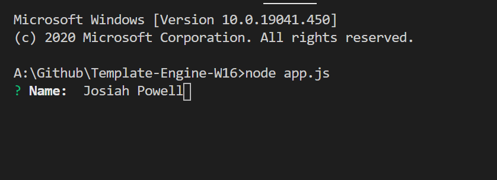
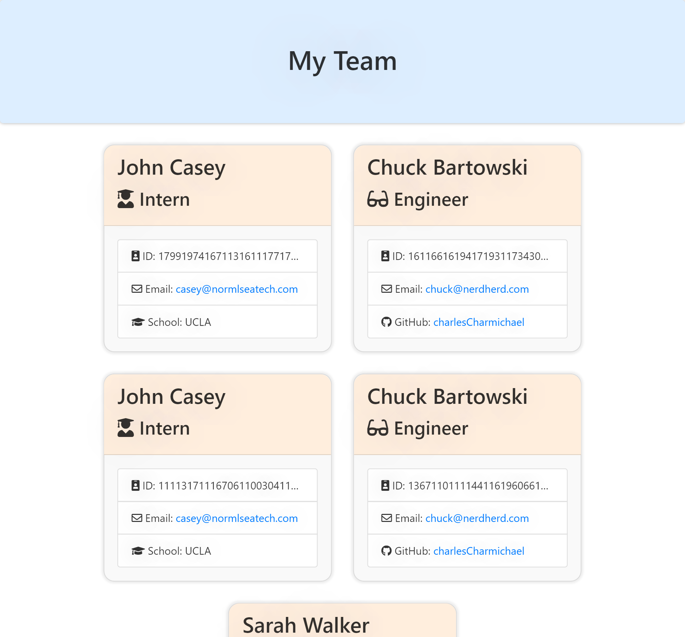

# Team Profile Generator

## Description

Need a simple team web page? This project allows you to generate a team portfolio web page from this CLI App.

## Instructions
1. Download and open the project in a terminal
2. type "node app.js" and hit enter.
3. Follow the steps.

## Questions

Contact me at <a href="mailto:josiahpowell@outlook.com">josiahpowell@outlook.com</a> or checkout my GitHub Profile at <a href="https://github.com/JoePall">JoePall</a>.

## License

MIT License

---

**AUTHOR:** JOSIAH **POWELL** 
**DATE:** 8/20/20